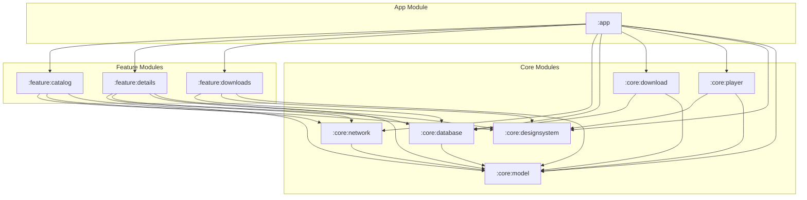
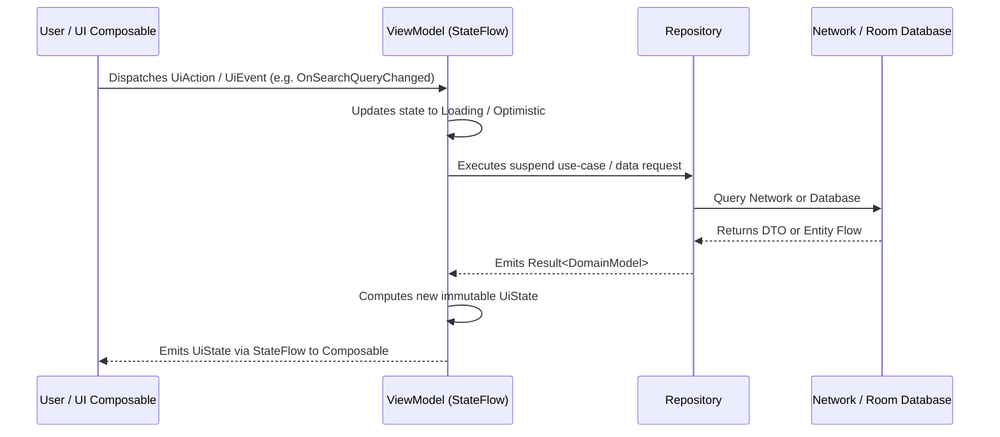

# IMIT — Internet Archive MIT OpenCourseWare Viewer

[](https://developer.android.com/)
[](https://kotlinlang.org/)
[](https://developer.android.com/jetpack/compose)
[](https://m3.material.io/)
[](https://insert-koin.io/)
[](https://developer.android.com/training/data-storage/room)
[](https://developer.android.com/media/media3)
[](https://developer.android.com/topic/libraries/architecture/workmanager)
[-informational)](https://developer.android.com/)
[](https://developer.android.com/)

**IMIT** (*Internet Archive MIT OCW Viewer*) is a modern, offline-first Android application designed for exploring, streaming, and downloading educational lecture videos from the [MIT OpenCourseWare](https://ocw.mit.edu/) collection hosted on the [Internet Archive](https://archive.org/).

Built with **Modern Android Development (MAD)** practices: 100% Kotlin, Jetpack Compose Material 3, Unidirectional Data Flow (UDF), Koin Dependency Injection, Room 3.x, Media3 ExoPlayer, and Android WorkManager within a modular Clean Architecture.

---

## 🏛️ Architectural Overview


IMIT follows **Clean Architecture** principles structured as a multi-module Gradle project. Architectural layers enforce strict dependency isolation: presentation depends on domain/core abstractions, never on concrete network or persistence implementations.

### Module Dependency Graph



---

## ✨ Features

- **📚 Catalog & Exploration (`:feature:catalog`)**
  - Search MIT OCW video collection by keywords and course topics.
  - Infinite scroll pagination powered by reactive StateFlow.
  - Responsive lecture cards featuring high-resolution thumbnails, durations, and metadata.
- **🔍 Video Details & Overview (`:feature:details`)**
  - Course metadata, lecture index, speaker information, and direct streaming links.
  - Single-tap streaming playback and one-click offline download scheduling.
- **📺 Media3 Streaming & PiP (`:core:player`)**
  - Built on **AndroidX Media3 ExoPlayer** with custom adaptive playback controls.
  - Seamless system **Picture-in-Picture (PiP)** mode with automated aspect ratio preservation and playback action controls.
- **⚡ Background Download Engine (`:core:download`)**
  - Robust file streaming via OkHttp with 8 KB chunking managed by **AndroidX WorkManager**.
  - Worker constructor injection powered by **Koin** (`worker { }` DSL and `workManagerFactory()`).
  - Real-time percentage progress updates reported through persistent Room updates and low-importance foreground notifications.
  - **Storage space guard**: verifies available disk space (`>= 500 MB`) via `StatFs` before enqueueing or streaming.
  - Cooperative cancellation handling: cleans up partial files on disk and marks status as `PAUSED` without leaking resources.
- **💾 Offline Library & Persistence (`:feature:downloads`, `:core:database`)**
  - Reactive Room 3.x SQLite database tracking download states (`DOWNLOADING`, `COMPLETED`, `PAUSED`, `FAILED`).
  - Offline video playback directly from local app storage without network requirements.
  - Storage space indicators and one-tap video deletion.
- **🎨 MIT Cardinal Design System (`:core:designsystem`)**
  - Curated Jetpack Compose Material 3 design tokens inspired by MIT's signature crimson palette: Cardinal Red (`#A31F34`), Cool Gray, and Dark Charcoal.
  - Full dynamic Dark Theme and Light Theme support.

---

## 🏗️ Module Inventory

| Module | Type | Description |
| :--- | :--- | :--- |
| [`:app`](file:///d:/AndroidProject/IMIT/app) | Application | Application entry point (`IMITApplication`), DI graph composition, Single-Activity container (`MainActivity`), and Compose Navigation (`MitOcwNavGraph`). |
| [`:feature:catalog`](file:///d:/AndroidProject/IMIT/feature/catalog) | Android Feature | Video catalog browsing, search bar, topic filters, and infinite scroll pagination. |
| [`:feature:details`](file:///d:/AndroidProject/IMIT/feature/details) | Android Feature | Lecture overview screen, video descriptions, download trigger, and playback actions. |
| [`:feature:downloads`](file:///d:/AndroidProject/IMIT/feature/downloads) | Android Feature | Offline library management, downloaded video playback, download progress monitoring, and deletion. |
| [`:core:player`](file:///d:/AndroidProject/IMIT/core/player) | Android Library | Media3 ExoPlayer management, custom video player composable, playback state handling, and Picture-in-Picture helper (`PipHelper`). |
| [`:core:download`](file:///d:/AndroidProject/IMIT/core/download) | Android Library | Background download engine with `VideoDownloadWorker`, Koin worker injection, foreground notifications, and `DownloadManagerHelper`. |
| [`:core:database`](file:///d:/AndroidProject/IMIT/core/database) | Android Library | Room 3.x database (`ImitDatabase`), DAOs (`DownloadedVideoDao`), SQLite type converters, and offline persistence. |
| [`:core:network`](file:///d:/AndroidProject/IMIT/core/network) | Android Library | Retrofit 3.0, OkHttp 5.5, Archive.org Metadata & Scraping API services, interceptors, and DTO-to-Domain mappers. |
| [`:core:designsystem`](file:///d:/AndroidProject/IMIT/core/designsystem) | Android Library | Material 3 theme definitions, MIT brand color tokens, typography scales, shapes, icons, and reusable UI components. |
| [`:core:model`](file:///d:/AndroidProject/IMIT/core/model) | Pure Kotlin Library | Platform-independent domain entities (`VideoItem`, `DownloadedVideo`, `DownloadStatus`, etc.). |

---

## 🛠️ Technology Stack & Dependencies

All dependencies are centrally managed via the Gradle Version Catalog ([`gradle/libs.versions.toml`](file:///d:/AndroidProject/IMIT/gradle/libs.versions.toml)):

| Category | Component / Library | Version | Role in IMIT |
| :--- | :--- | :--- | :--- |
| **Language** | Kotlin | `2.2.10` | 100% Kotlin codebase with coroutines and serialization |
| **Build System** | Android Gradle Plugin (AGP) | `9.3.2` | Gradle build system with Configuration Cache enabled |
| **UI Framework** | Jetpack Compose (BOM) | `2026.02.01` | Declarative UI toolkit with Material 3 components |
| **Navigation** | Navigation Compose | `2.9.8` | Type-safe single-activity navigation graph |
| **Dependency Injection** | Koin (BOM) | `4.2.2` | Lightweight pragmatic DI for Android, Compose, and WorkManager |
| **Networking** | Retrofit & OkHttp | `3.0.0` / `5.5.0` | HTTP client with connection pooling, logging, and timeouts |
| **Serialization** | kotlinx.serialization | `1.11.0` | High-performance JSON serialization |
| **Local Database** | Room 3.x | `3.0.2` | Reactive SQLite persistence with KSP code generation |
| **Media Player** | AndroidX Media3 ExoPlayer | `1.11.0` | Video streaming, surface rendering, and playback lifecycle |
| **Image Loading** | Coil 3.x | `3.4.0` | Compose-first asynchronous image loading with OkHttp caching |
| **Background Work** | WorkManager | `2.11.2` | Resilient, battery-friendly background video download jobs |
| **Testing** | JUnit4, MockK, Turbine | `4.13.2` / `1.14.11` / `1.2.1` | Unit testing, coroutines flow assertions, and mock verification |

---

## 🔄 State Management & Unidirectional Data Flow (UDF)

Each feature screen strictly implements the **Unidirectional Data Flow (UDF)** pattern:



- **`UiState`**: Immutable sealed interface representing every possible UI state (e.g. `Loading`, `Success`, `Error`, `Empty`).
- **`UiAction` / `UiEvent`**: Sealed interface representing all user intents and actions (e.g. `OnRefresh`, `OnVideoClick`, `OnDownloadClick`).
- **One-off Events**: Dispatched via `Channel<UiEffect>` and consumed with `LaunchedEffect`.

---

## 💉 Dependency Injection Architecture

IMIT uses **Koin 4.x** with constructor-based injection without annotation processing reflection:

```kotlin
// Example: Core download module registration
val downloadModule = module {
    single { DownloadManagerHelper(androidContext()) }

    worker {
        VideoDownloadWorker(
            context = get(),
            workerParams = get(),
            okHttpClient = get(),
            downloadDao = get()
        )
    }
}
```

- **Application Wiring**: Custom `workManagerFactory()` is initialized alongside all core and feature modules in [`IMITApplication.kt`](file:///d:/AndroidProject/IMIT/app/src/main/java/com/uncaan/imit/app/IMITApplication.kt).
- **WorkManager Startup**: Default `WorkManagerInitializer` is disabled in [`app/src/main/AndroidManifest.xml`](file:///d:/AndroidProject/IMIT/app/src/main/AndroidManifest.xml) to give Koin explicit control over worker creation.
- **Compose ViewModel Injection**: Injected seamlessly into screen composables using `koinViewModel()`.

---

## 🚀 Getting Started

### Prerequisites

- **Android Studio**: Android Studio Ladybug (2024.2.1+) or newer recommended.
- **JDK**: Java Development Kit (JDK) 17 or higher.
- **Android SDK**:
  - `compileSdk`: **37**
  - `targetSdk`: **37**
  - `minSdk`: **24** (Android 7.0 Nougat)

### Setup & Build

1. **Clone the repository:**
   ```bash
   git clone https://github.com/prayogizan/IMIT.git
   cd IMIT
   ```

2. **Open in Android Studio:**
   - Select **File > Open** and choose the `IMIT` root directory.
   - Allow Gradle to sync dependencies and project structure.

3. **Build the debug APK:**
   ```bash
   ./gradlew assembleDebug
   ```

4. **Install and run on a device/emulator:**
   ```bash
   ./gradlew installDebug
   ```

---

## 🧪 Testing Strategy

IMIT emphasizes robust unit testing across ViewModel states, repositories, mappers, and dependency injection graphs.

```bash
# Run all unit tests across all modules
./gradlew test

# Run tests for specific modules
./gradlew :core:download:testDebugUnitTest
./gradlew :core:network:testDebugUnitTest
./gradlew :core:player:testDebugUnitTest
./gradlew :app:testDebugUnitTest
```

### Testing Standards
- **Turbine**: Used for asserting reactive `StateFlow` and `Flow<Result<T>>` emissions.
- **MockK**: Provides relaxed and strict mocking for Android system services and DAOs.
- **Coroutines Test**: Standard `StandardTestDispatcher` and `runTest` for deterministic asynchronous testing.
- **Koin Module Verification**: Unit tests verify that every module's dependency graph can be cleanly resolved.

---

## 📖 Engineering Documentation

Deep-dive architecture contracts, API schemas, and development guidelines are maintained in the [`engineer_docs/`](file:///d:/AndroidProject/IMIT/engineer_docs/) directory:

| Document | Focus & Scope |
| :--- | :--- |
| [**Architecture Overview**](engineer_docs/architecture.md) | Architectural layers, system boundary rules, and high-level component diagrams. |
| [**Module Reference**](engineer_docs/modules.md) | File-by-file inventory, responsibility breakdown, and dependencies for all modules. |
| [**Data Flow & State**](engineer_docs/data_flow.md) | Unidirectional Data Flow patterns, `StateFlow` handling, and offline sync strategies. |
| [**Design System**](engineer_docs/design_system.md) | Color palettes, typography scales, elevation tokens, and custom UI components. |
| [**API & Network Layer**](engineer_docs/api_reference.md) | Internet Archive endpoints, DTO contracts, OkHttp interceptors, and error mapping. |
| [**Database Schema**](engineer_docs/database.md) | Room entities, DAOs, converters, migration rules, and index strategies. |
| [**Navigation Architecture**](engineer_docs/navigation.md) | Navigation Compose routing, bottom navigation tabs, deep links, and argument passing. |
| [**Dependency Injection**](engineer_docs/dependency_injection.md) | Koin module definitions, scope lifetimes, worker factories, and ViewModel binding. |
| [**Testing Guide**](engineer_docs/testing.md) | Test conventions, naming rules, MockK patterns, and coverage expectations. |

---

## 📜 Coding Conventions & Guidelines

- **Zero Placeholders**: All code contributions must be fully functional and production-ready without `TODO` shortcuts.
- **Architectural Integrity**: Presentation layers must never reference DAOs or network clients directly; all data must pass through repositories.
- **Cancellation Safety**: Coroutines must never swallow `CancellationException`; always rethrow to preserve coroutine hierarchy cancellation.
- **KDoc Documentation**: All public classes, interfaces, ViewModel methods, and composable functions must include descriptive KDoc comments.

---

## ⚖️ Acknowledgments & Data Attribution

- Educational content, lecture videos, and course metadata are provided courtesy of [MIT OpenCourseWare](https://ocw.mit.edu/).
- Video streaming and metadata queries are hosted and served by the [Internet Archive](https://archive.org/).
