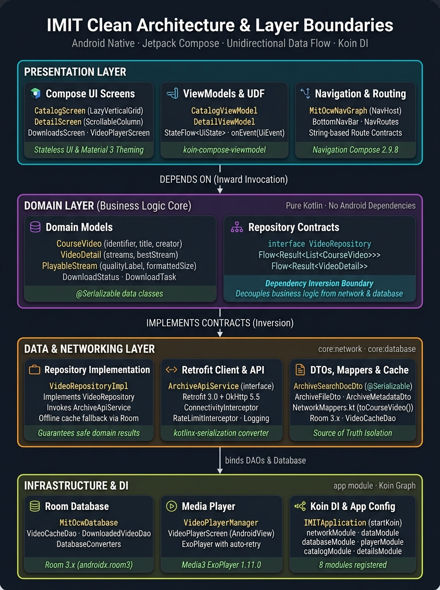
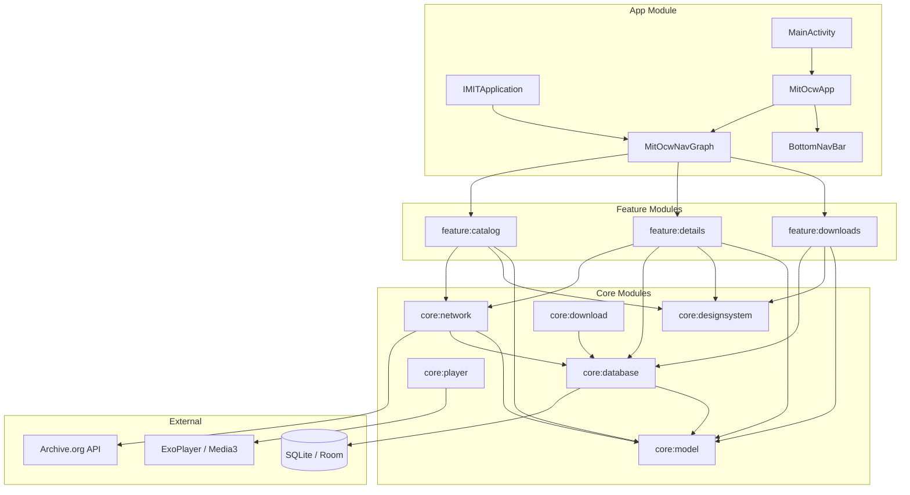
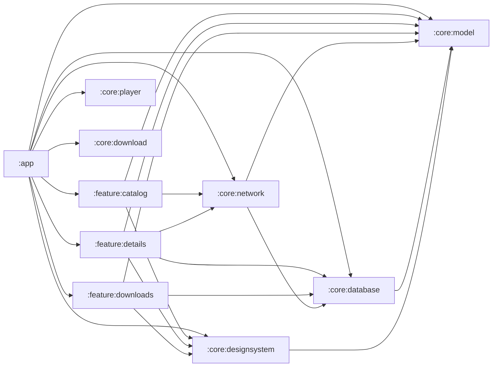
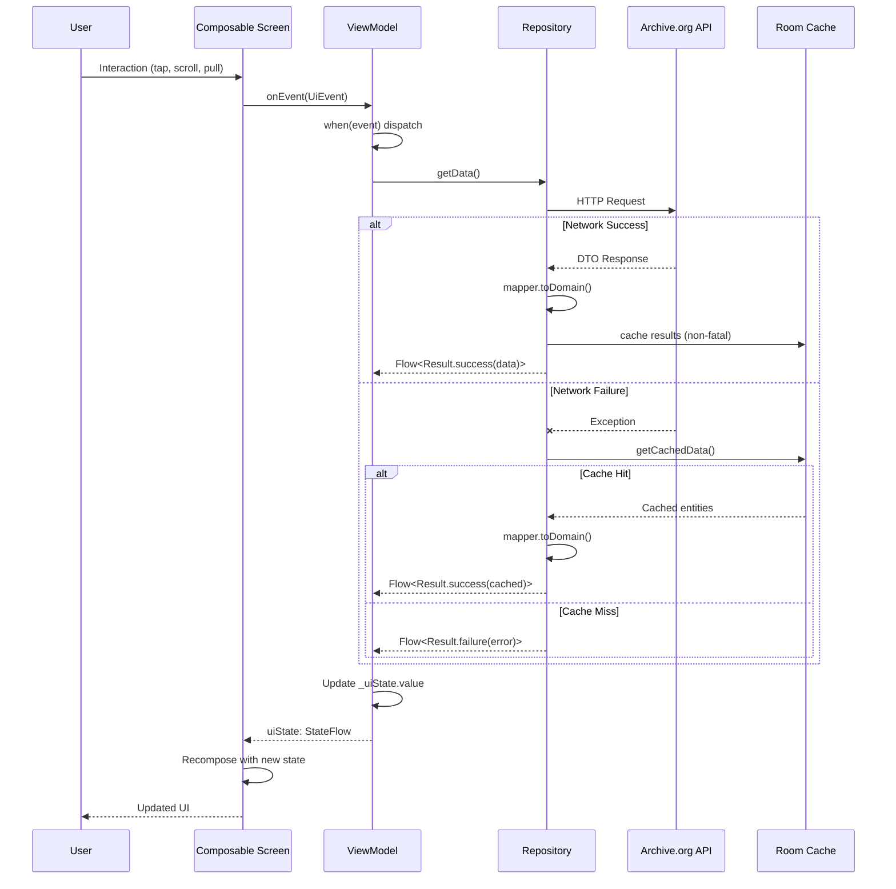

# Architecture Overview



## High-Level System Diagram



## Module Dependency Graph



### Dependency Rules

1. **Feature modules** depend on `core:*` modules only. Never on other features.
2. **`core:model`** has ZERO dependencies (pure Kotlin, no Android framework).
3. **`core:network`** depends on `core:model` and `core:database` (for offline caching).
4. **`core:database`** depends on `core:model` (entities map to domain models).
5. **`core:designsystem`** depends on `core:model` (components accept domain types like `CourseVideo`).
6. **`app`** depends on ALL modules — it wires Koin DI and navigation.

## Unidirectional Data Flow (UDF)



### UDF Components per Feature

Each feature consists of exactly 4 files:

| File | Type | Responsibility |
|------|------|---------------|
| `{Feature}UiState.kt` | `sealed interface` | All possible screen states |
| `{Feature}UiEvent.kt` | `sealed interface` | All possible user actions |
| `{Feature}ViewModel.kt` | `ViewModel` | State management, event routing |
| `{Feature}Screen.kt` | `@Composable` | UI rendering, event dispatch |

### State Contract

```kotlin
sealed interface {Feature}UiState {
    data object Loading : {Feature}UiState
    data class Success(/* fields with defaults */) : {Feature}UiState
    data class Error(val message: String) : {Feature}UiState
}
```

Every UiState has exactly 3 variants: `Loading`, `Success`, `Error`.

### Event Contract

```kotlin
sealed interface {Feature}UiEvent {
    // Parameterless actions
    data object Refresh : {Feature}UiEvent
    // Parameterized actions
    data class SelectItem(val id: String) : {Feature}UiEvent
}
```

### ViewModel Contract

```kotlin
class {Feature}ViewModel(
    private val repository: SomeRepository
) : ViewModel() {
    private val _uiState = MutableStateFlow<{Feature}UiState>({Feature}UiState.Loading)
    val uiState: StateFlow<{Feature}UiState> = _uiState.asStateFlow()

    fun onEvent(event: {Feature}UiEvent) {
        when (event) {
            is {Feature}UiEvent.Refresh -> refresh()
            // ...
        }
    }
}
```

Single `onEvent()` entry point. No public methods besides `onEvent()` and read-only state.

## Layer Architecture

```
┌─────────────────────────────────────────────┐
│              Presentation Layer             │
│  (feature:catalog, feature:details, ...)    │
│  Screen → ViewModel → UiState/UiEvent       │
├─────────────────────────────────────────────┤
│               Domain Layer                  │
│  (core:model)                               │
│  CourseVideo, VideoDetail, PlayableStream    │
├─────────────────────────────────────────────┤
│                Data Layer                   │
│  (core:network + core:database)             │
│  Repository → API Service + DAO             │
│  DTOs → Mappers → Domain Models             │
├─────────────────────────────────────────────┤
│           Infrastructure Layer              │
│  (core:player, core:download,               │
│   core:designsystem)                        │
│  ExoPlayer, WorkManager, Theme/Components   │
└─────────────────────────────────────────────┘
```

## Build Configuration

- **Version Catalog**: Single `gradle/libs.versions.toml` for all dependency versions
- **BOM Management**: Compose BOM and Koin BOM manage transitive versions
- **Plugin Aliases**: `libs.plugins.*` in root `build.gradle.kts`
- **Java Compatibility**: Java 17 source/target
- **Compose Compiler**: Managed via `kotlin.compose` plugin (Kotlin 2.x)
- **KSP**: Used for Room annotation processing (not KAPT)
