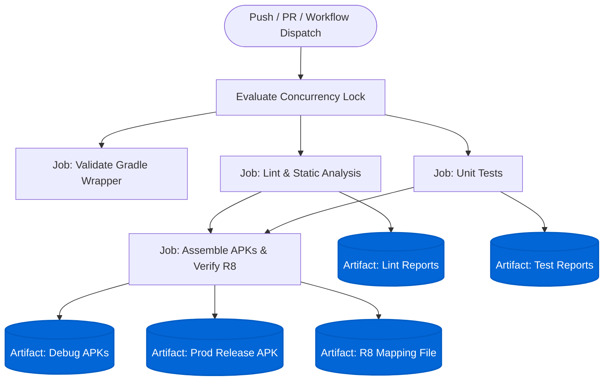

# Continuous Integration & Deployment (CI/CD)

This document describes the automated Continuous Integration (CI) pipeline for the IMIT project hosted on GitHub Actions.

---

## 1. High-Level CI Architecture



---

## 2. Pipeline Configuration Overview

| Parameter | Specification | Purpose |
|---|---|---|
| **Workflow File** | `.github/workflows/ci.yml` | Declarative pipeline definition |
| **Runner OS** | `ubuntu-latest` | High-throughput Linux runner |
| **Java Version** | `21` (`temurin`) | Aligned with Gradle 9.5 daemon JVM (`gradle-daemon-jvm.properties`) |
| **Gradle Setup** | `gradle/actions/setup-gradle@v4` | Automated dependency & build caching |
| **Wrapper Validation** | `gradle/actions/wrapper-validation@v4` | Cryptographic verification of `gradlew.jar` |
| **Artifact Retention** | `7 days` | Efficient GitHub Actions storage utilization |

### Triggers & Concurrency
- **Push Events:** Triggers on branches `main` and `pre-main`.
- **Pull Request Events:** Triggers on PRs targeting `main` and `pre-main`.
- **Manual Trigger:** Supports `workflow_dispatch` for on-demand execution.
- **Concurrency Control:** `cancel-in-progress: true` terminates redundant builds on earlier commits within the same PR.

```yaml
concurrency:
  group: ${{ github.workflow }}-${{ github.ref }}
  cancel-in-progress: ${{ github.event_name == 'pull_request' }}
```

---

## 3. Job Specifications

### 1. `validate-wrapper`
- **Goal:** Verifies the cryptographic checksum of `gradle/wrapper/gradle-wrapper.jar` against official Gradle release hashes.
- **Action:** `gradle/actions/wrapper-validation@v4`
- **Failure Impact:** Prevents execution of untrusted binary wrapper files across all subsequent jobs.

### 2. `lint`
- **Goal:** Executes Android Lint static analysis across all project modules.
- **Command:** `./gradlew lintDebug --continue --stacktrace`
- **Output Artifacts:** HTML and XML reports stored under `**/build/reports/lint-results-debug.*`.
- **Condition:** `if: always()` uploads reports regardless of lint pass/fail state for rapid debugging.

### 3. `unit-tests`
- **Goal:** Executes unit tests across all 10 modules (`core:*`, `feature:*`, `app`).
- **Command:** `./gradlew testDebugUnitTest --continue --stacktrace`
- **Coverage Scope:**
  - `core:model`: Data class logic and validation.
  - `core:network`: MockWebServer API contracts, serialization, interceptors, and repository implementations.
  - `core:database`: Room converters, mappers, and DAO logic.
  - `core:download`: Download helper and status tracking.
  - `core:designsystem`: Theme tokens.
  - `feature:*`: ViewModel state flows, event dispatching, and debounce logic with Turbine.
- **Output Artifacts:** Test XMLs and HTML summaries stored under `**/build/reports/tests/` and `**/build/test-results/`.

### 4. `build`
- **Goal:** Verifies compilation across all variants and executes full production R8 minification and resource shrinking.
- **Dependency:** `needs: [lint, unit-tests]` (only builds after quality gates pass).
- **Command:** `./gradlew assembleDebug assembleProdRelease --stacktrace`
- **Output Artifacts:**
  - `app-debug-apks`: `app/build/outputs/apk/**/debug/*.apk` (`app-dev-debug.apk` and `app-prod-debug.apk`) for QA and local testing.
  - `app-prod-release-apk`: `app/build/outputs/apk/prod/release/*.apk` (minified production release APK, ~4.14 MB).
  - `prod-release-mapping`: `app/build/outputs/mapping/prodRelease/mapping.txt` (deobfuscation mapping retained for 14 days).

---

## 4. Performance & Caching Strategy

1. **Gradle 9.5 & Configuration Cache:**
   - `gradle.properties` configures `org.gradle.configuration-cache=true`.
   - Subsequent builds reuse existing configuration phases.
2. **`setup-gradle@v4` User Home Caching:**
   - Automatically caches downloaded Gradle distributions and resolution caches.
   - Saves 2–4 minutes of network overhead per runner run.
3. **Cache Pollution Prevention:**
   - Enforces `cache-read-only: ${{ github.ref != 'refs/heads/main' && github.ref != 'refs/heads/pre-main' }}`.
   - Pull requests read from the Gradle cache to speed up verification without overwriting the cache entry with experimental or unmerged dependency states.
4. **Direct Job Summaries:**
   - Configured with `add-job-summary: 'on-failure'` (and `'always'` for build) to render Gradle build results and timings directly in GitHub Actions run summaries.
5. **JDK 21 Toolchain Alignment:**
   - Running Gradle under Temurin JDK 21 prevents runtime daemon re-spawns and ensures foojay toolchain resolver convention resolves effortlessly.

---

## 5. Local Reproduction & Pre-Push Checklist

Before pushing commits or opening a PR, developers can execute the exact CI steps locally:

```bash
# 1. Run Android Lint checks (all flavors)
./gradlew lintDebug

# 2. Run all unit tests (all flavors)
./gradlew testDebugUnitTest

# 3. Assemble debug APKs (all flavors)
./gradlew assembleDebug

# 4. Assemble minified prod release APK (verifies R8 shrinking)
./gradlew assembleProdRelease

# Flavor-specific commands:
./gradlew assembleDevDebug
./gradlew assembleProdDebug

# Complete one-liner verification:
./gradlew lintDebug testDebugUnitTest assembleDebug assembleProdRelease
```

---

## 6. Failure Triage Guide

| Failure Mode | Diagnosis Step | Resolution |
|---|---|---|
| **Wrapper Validation Failed** | Hash mismatch in `gradle-wrapper.jar` | Run `./gradlew wrapper --gradle-version 9.5.0` and commit the official wrapper binary |
| **Permission Denied (`./gradlew`)** | Missing Unix execute bit on `gradlew` | The pipeline automatically runs `chmod +x gradlew`; ensure git mode is preserved via `git update-index --chmod=+x gradlew` |
| **Lint Error** | Review `lint-reports` artifact from Actions tab | Fix lint warnings marked as `Error` or suppress with `@SuppressLint` if intentional |
| **Unit Test Failure** | Review `unit-test-reports` HTML report | Replicate failing test via `./gradlew :<module>:testDebugUnitTest --tests "<FailingTest>"` |
| **Out of Memory (OOM)** | Gradle daemon killed | Increase heap allocation in `gradle.properties` (`-Xmx2048m` default) |
