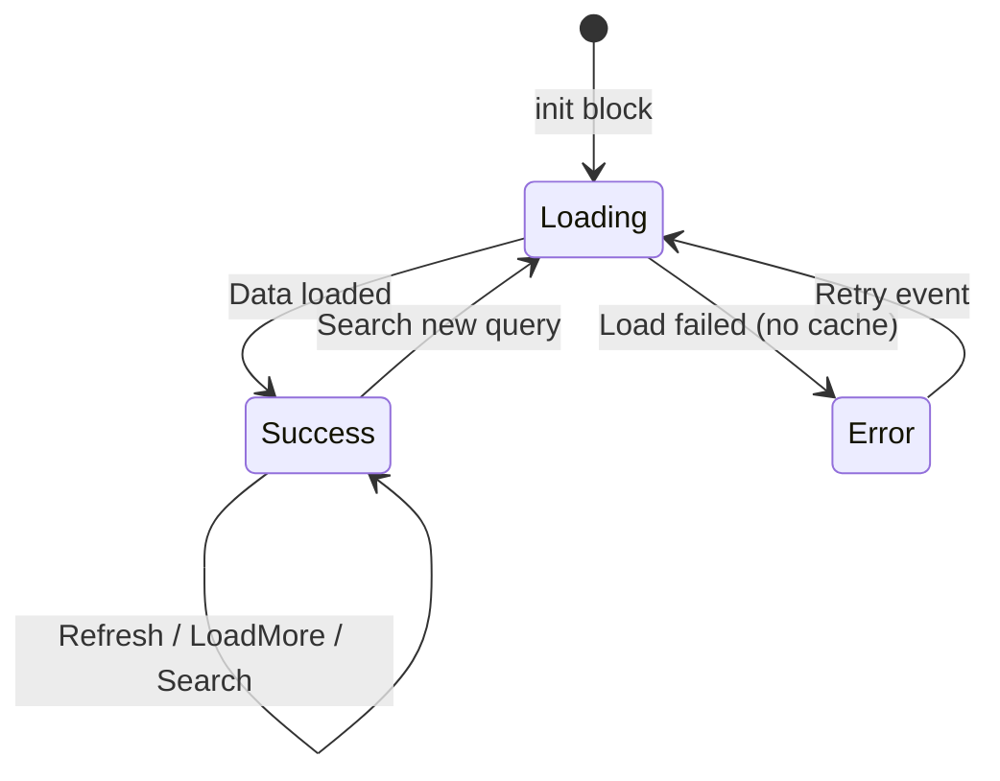
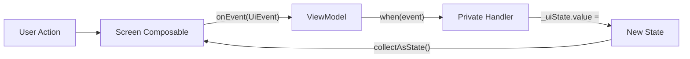
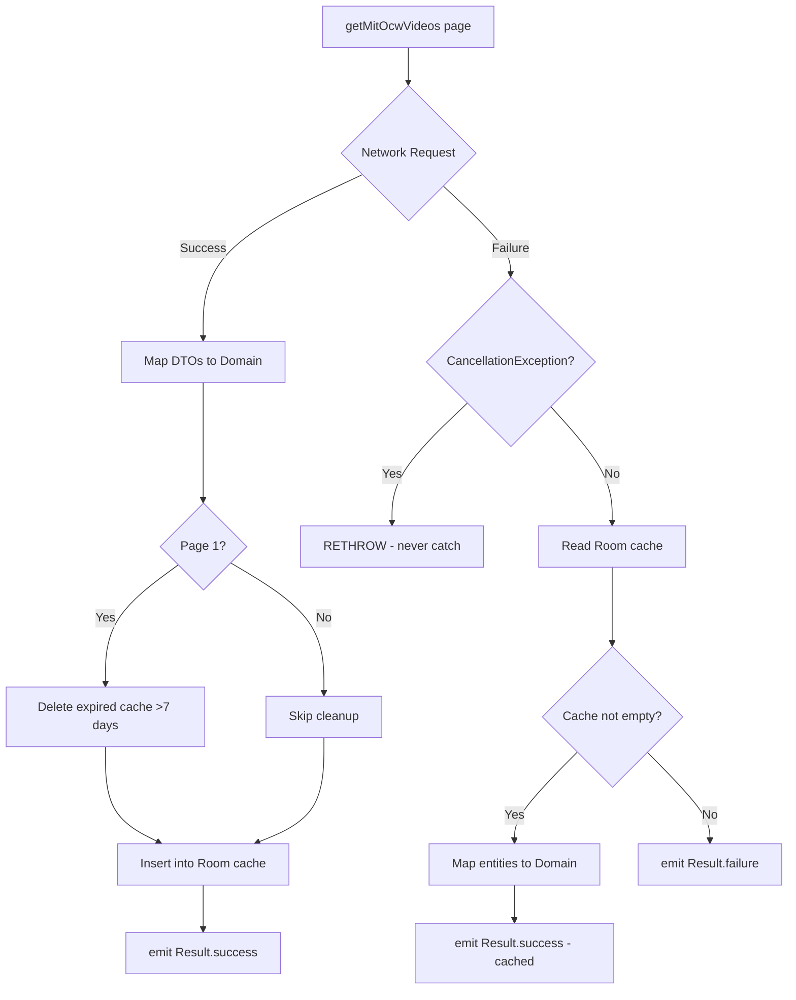
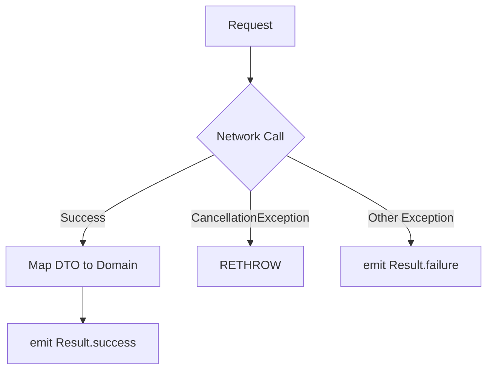

# Data Flow & State Management

## State Management Pattern

Every feature uses `StateFlow` with sealed interface states:



## StateFlow Exposure Pattern

```kotlin
// Private mutable - only ViewModel writes
private val _uiState = MutableStateFlow<CatalogUiState>(CatalogUiState.Loading)

// Public read-only - Screen observes
val uiState: StateFlow<CatalogUiState> = _uiState.asStateFlow()
```

**Why `asStateFlow()`?** Prevents consumers from casting to `MutableStateFlow` and writing directly.

## Event Dispatch Flow



### Catalog Event Flow

| Event | Handler | State Transition |
|-------|---------|-----------------|
| `Refresh` | `refresh()` | `Success(isRefreshing=true)` → network → `Success(isRefreshing=false)` |
| `LoadMore` | `loadMore()` | `Success(isLoadingMore=true)` → network → `Success(videos += newPage)` |
| `Retry` | `retry()` | Any → `Loading` → network → `Success` or `Error` |
| `SearchQueryChanged(q)` | `onSearchQueryChanged(q)` | Debounce 300ms → `Loading` → search → `Success(searchQuery=q)` |
| `ClearSearch` | `clearSearch()` | Any → `Loading` → reload page 1 |

### Detail Event Flow

| Event | Handler | State Transition |
|-------|---------|-----------------|
| `SelectQuality(stream)` | `selectQuality(stream)` | `Success(selectedStream=stream)` |
| `StreamVideo` | `streamVideo()` | Sets `navigateToPlayer` StateFlow → consumed by `LaunchedEffect` |
| `DownloadVideo` | `initiateDownload()` | Inserts `DownloadedVideoEntity(PENDING)` → `Success(downloadStatus=PENDING)` |
| `ToggleDescription` | `toggleDescription()` | `Success(isDescriptionExpanded=!current)` |
| `Retry` | `loadDetail()` | Any → `Loading` → network → `Success` or `Error` |

## Repository Data Flow

### Network-First with Cache Fallback (getMitOcwVideos)



### Network-Only (getVideoDetail, searchVideos)



## CancellationException Handling

**Critical Rule**: Every `catch (e: Exception)` block must be preceded by `catch (e: CancellationException) { throw e }`.

```kotlin
try {
    // suspend operation
} catch (e: CancellationException) {
    throw e  // MANDATORY - coroutine cancellation must propagate
} catch (e: Exception) {
    // Handle other errors
}
```

This prevents coroutine cancellation from being swallowed, which would cause:
- Memory leaks (coroutine continues running after scope cancelled)
- `viewModelScope` cleanup failures
- Structured concurrency violations

## Pagination Strategy

```kotlin
private val allVideos = mutableListOf<CourseVideo>()
private var currentPage = 1

// On success:
if (isRefresh || page == 1) allVideos.clear()
allVideos.addAll(videos)
currentPage = page

_uiState.value = CatalogUiState.Success(
    videos = allVideos.toList(),  // Defensive copy
    canLoadMore = videos.size >= 20,  // Page size threshold
    currentPage = currentPage
)
```

**Key details:**
- `allVideos` is accumulated in ViewModel (not in UiState)
- `toList()` creates defensive copy for immutable state
- `canLoadMore = videos.size >= 20` — if page returns fewer than 20, no more pages
- `LoadMore` only fires when `canLoadMore && !isLoadingMore` (prevents duplicate loads)

## Search Debounce Implementation

```kotlin
private var searchJob: Job? = null

private fun onSearchQueryChanged(query: String) {
    searchJob?.cancel()                    // Cancel previous search
    searchJob = viewModelScope.launch {
        delay(300)                         // 300ms debounce
        if (query.isBlank()) {
            clearSearch()
            return@launch
        }
        _uiState.value = CatalogUiState.Loading
        allVideos.clear()
        videoRepository.searchVideos(query, page = 1).first().fold(/* ... */)
    }
}
```

- Previous search job cancelled on each keystroke
- 300ms delay before executing API call
- Blank query triggers `clearSearch()` (returns to browsing mode)

## Offline Detection

Two levels of offline awareness:

### 1. Network Layer (ConnectivityInterceptor)
Throws `NoConnectivityException` before HTTP request if device is offline.

### 2. ViewModel Layer (Error Classification)
```kotlin
onFailure = { error ->
    if (allVideos.isNotEmpty()) {
        // Data exists: show it with offline banner
        _uiState.value = CatalogUiState.Success(
            videos = allVideos.toList(),
            isOffline = error is NoConnectivityException,
            canLoadMore = false
        )
    } else {
        // No data: show error screen
        _uiState.value = CatalogUiState.Error(
            message = when (error) {
                is NoConnectivityException -> "No internet connection."
                else -> "Failed to load videos: ${error.localizedMessage}"
            }
        )
    }
}
```

## Navigation One-Shot Events

Detail screen uses a secondary StateFlow for navigation:

```kotlin
// ViewModel
private val _navigateToPlayer = MutableStateFlow<String?>(null)
val navigateToPlayer: StateFlow<String?> = _navigateToPlayer.asStateFlow()

fun onPlayerNavigated() {
    _navigateToPlayer.value = null  // Reset after consumption
}

// Screen
LaunchedEffect(navigateToPlayer) {
    navigateToPlayer?.let { videoUrl ->
        onPlayVideo(videoUrl)
        viewModel.onPlayerNavigated()  // Prevent re-navigation on recomposition
    }
}
```

Pattern: emit URL → `LaunchedEffect` consumes → reset to `null`.
