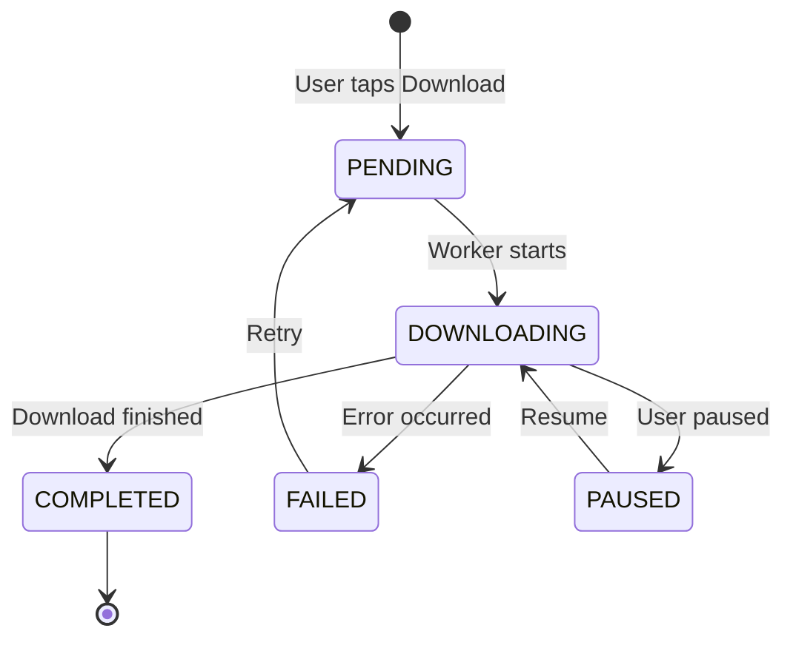

# Database Schema

## Overview

Room 3.x database (`MitOcwDatabase`) with 2 tables, KSP-generated implementations.

```kotlin
@Database(
    entities = [VideoCacheEntity::class, DownloadedVideoEntity::class],
    version = 1,
    exportSchema = true
)
@ColumnTypeConverters(DatabaseConverters::class)
abstract class MitOcwDatabase : RoomDatabase() {
    abstract fun videoCacheDao(): VideoCacheDao
    abstract fun downloadedVideoDao(): DownloadedVideoDao
}
```

Database name: `"mit_ocw_database"`

---

## Table: `video_cache`

Offline cache for video catalog listings. Entries auto-expire after 7 days.

### Schema

| Column | Type | Nullable | Default | Description |
|--------|------|----------|---------|-------------|
| `identifier` | TEXT | No | — | **PRIMARY KEY**. Archive.org item ID. |
| `title` | TEXT | No | — | Video title |
| `description` | TEXT | No | — | Video description |
| `creator` | TEXT | No | — | Instructor/creator name |
| `year` | INTEGER | No | — | Publication year |
| `thumbnail_url` | TEXT | No | — | Thumbnail image URL |
| `downloads_count` | INTEGER | No | — | Total download count |
| `cached_at` | INTEGER | No | `currentTimeMillis()` | Cache timestamp (epoch ms) |

### Entity

```kotlin
@Entity(tableName = "video_cache")
data class VideoCacheEntity(
    @PrimaryKey
    val identifier: String,
    val title: String,
    val description: String,
    val creator: String,
    val year: Int,
    @ColumnInfo(name = "thumbnail_url")
    val thumbnailUrl: String,
    @ColumnInfo(name = "downloads_count")
    val downloadsCount: Long,
    @ColumnInfo(name = "cached_at")
    val cachedAt: Long = System.currentTimeMillis()
)
```

### DAO Operations

| Operation | Method | Return | Description |
|-----------|--------|--------|-------------|
| Insert one | `insert(video)` | — | Upsert (REPLACE on conflict) |
| Insert batch | `insertAll(videos)` | — | Batch upsert |
| Get all (reactive) | `getAllVideos()` | `Flow<List<...>>` | Observe all cached, newest first |
| Get all (one-shot) | `getCachedVideos()` | `List<...>` | Suspend, newest first |
| Get by ID | `getVideoById(id)` | `Entity?` | Suspend, nullable |
| Search | `searchVideos(query)` | `Flow<List<...>>` | LIKE search on title + description |
| Delete expired | `deleteExpired(threshold)` | `Int` | Deletes entries with `cached_at < threshold` |
| Clear all | `clearAll()` | `Int` | Delete everything |

### Caching Strategy

```
Page 1 load:
  1. Delete expired entries (> 7 days old)
  2. Insert/replace new results
  
Any page load:
  1. Insert/replace new results (non-fatal failure OK)
  
Network failure:
  1. Read cached entries as fallback
  2. If cache empty, propagate error
```

---

## Table: `downloaded_videos`

Tracks download state and local file paths for offline playback.

### Schema

| Column | Type | Nullable | Default | Description |
|--------|------|----------|---------|-------------|
| `identifier` | TEXT | No | — | **PRIMARY KEY**. Archive.org item ID. |
| `title` | TEXT | No | — | Video title |
| `description` | TEXT | Yes | — | Video description |
| `file_name` | TEXT | No | — | Original file name (e.g., `lecture01_720p.mp4`) |
| `download_url` | TEXT | No | — | Remote download URL |
| `local_file_path` | TEXT | Yes | — | Local file path after download completes |
| `file_size_bytes` | INTEGER | No | — | Expected file size in bytes |
| `progress` | INTEGER | No | `0` | Download progress (0-100) |
| `status` | TEXT | No | `"PENDING"` | Download status (via converter) |
| `downloaded_at` | INTEGER | No | `0` | Completion timestamp (epoch ms) |

### Entity

```kotlin
@Entity(tableName = "downloaded_videos")
data class DownloadedVideoEntity(
    @PrimaryKey
    @ColumnInfo(name = "identifier")
    val identifier: String,
    @ColumnInfo(name = "title")
    val title: String,
    @ColumnInfo(name = "description")
    val description: String?,
    @ColumnInfo(name = "file_name")
    val fileName: String,
    @ColumnInfo(name = "download_url")
    val downloadUrl: String,
    @ColumnInfo(name = "local_file_path")
    val localFilePath: String?,
    @ColumnInfo(name = "file_size_bytes")
    val fileSizeBytes: Long,
    @ColumnInfo(name = "progress")
    val progress: Int = 0,
    @ColumnInfo(name = "status")
    val status: DownloadStatus = DownloadStatus.PENDING,
    @ColumnInfo(name = "downloaded_at")
    val downloadedAt: Long = 0L
)
```

### DAO Operations

| Operation | Method | Return | Description |
|-----------|--------|--------|-------------|
| Insert | `insert(entity)` | — | Upsert single download record |
| Insert batch | `insertAll(list)` | — | Batch upsert |
| Get all (reactive) | `getAllDownloadedVideos()` | `Flow<List<...>>` | Observe downloads, newest first |
| Get all (alias) | `getAllDownloads()` | `Flow<List<...>>` | Observe downloads, newest first |
| Get by ID (reactive) | `getDownloadedVideoById(id)` | `Flow<Entity?>` | Observe single download |
| Get by ID (one-shot) | `getDownloadedVideoByIdSync(id)` | `Entity?` | Suspend lookup |
| Get by status | `getDownloadedVideosByStatus(status)` | `Flow<List<...>>` | Filter by DownloadStatus |
| Total size (completed) | `getTotalDownloadedSize()` | `Long` | Sum bytes of completed downloads |
| Update progress | `updateProgress(id, progress, status)` | `Int` | Update progress + status |
| Mark completed | `markCompleted(id, localPath, status, time)` | `Int` | Set path + COMPLETED status |
| Delete by ID | `deleteById(id)` | `Int` | Delete single record |
| Delete by ID (alias) | `deleteDownload(id)` | `Int` | Delete single record |
| Delete entity | `delete(entity)` | `Int` | Delete by entity |
| Clear all | `clearAll()` | `Int` | Delete everything |

### Download Status Lifecycle



---

## Type Converters

### `DatabaseConverters`

Converts `DownloadStatus` enum to/from `String` for Room storage.

```kotlin
class DatabaseConverters {
    @ColumnTypeConverter
    fun fromDownloadStatus(status: DownloadStatus?): String? = status?.name

    @ColumnTypeConverter
    fun toDownloadStatus(value: String?): DownloadStatus? =
        value?.let { DownloadStatus.fromString(it) }
}
```

**Room 3.x note:** Uses `@ColumnTypeConverter` (not `@TypeConverter`) and `@ColumnTypeConverters` on the database class (not `@TypeConverters`).

---

## Entity ↔ Domain Mappers

### `DatabaseMappers.kt`

```kotlin
fun VideoCacheEntity.toCourseVideo(): CourseVideo
fun CourseVideo.toEntity(): VideoCacheEntity

fun DownloadedVideoEntity.toDownloadTask(): DownloadTask
fun DownloadTask.toEntity(): DownloadedVideoEntity
```

Bidirectional mapping. `toEntity()` sets `cachedAt = System.currentTimeMillis()` for cache entries.

---

## Koin Module

```kotlin
val databaseModule = module {
    single {
        Room.databaseBuilder(
            androidContext(),
            MitOcwDatabase::class.java,
            "mit_ocw_database"
        ).build()
    }
    single { get<MitOcwDatabase>().videoCacheDao() }
    single { get<MitOcwDatabase>().downloadedVideoDao() }
}
```

Database is singleton. DAOs extracted as separate singletons for direct injection.
