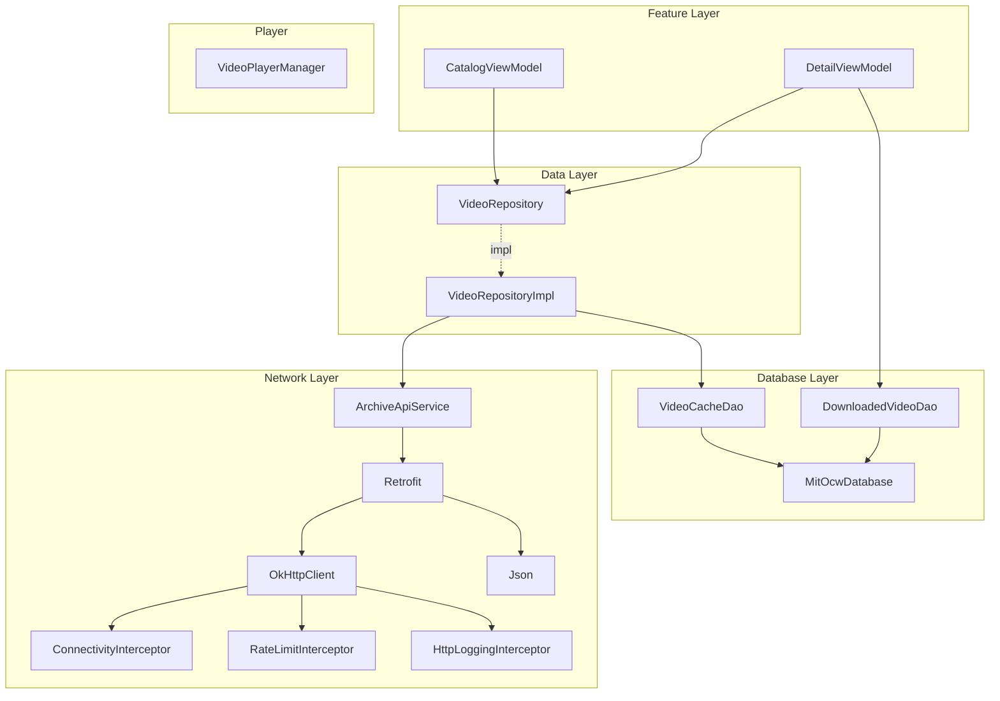

# Dependency Injection (Koin)

## Overview

Koin 4.2.2 (BOM-managed). No annotation processing, pure Kotlin DSL.

## Module Registry

All modules registered in `IMITApplication.startKoin`:

```kotlin
startKoin {
    androidLogger(if (BuildConfig.DEBUG) Level.DEBUG else Level.NONE)
    androidContext(this@IMITApplication)
    workManagerFactory()
    modules(
        // Core (order: dependencies first)
        networkModule,      // OkHttp, Retrofit, Json, ApiService
        dataModule,         // VideoRepository binding
        databaseModule,     // Room database, DAOs
        downloadModule,     // Download workers (WIP)
        playerModule,       // VideoPlayerManager
        // Features
        catalogModule,      // CatalogViewModel
        detailsModule,      // DetailViewModel
        downloadsModule,    // Downloads (WIP)
    )
}
```

## Module Definitions

### `networkModule` (`core:network`)

| Scope | Type | Binding |
|-------|------|---------|
| `single` | `Json` | kotlinx-serialization with lenient config |
| `single` | `HttpLoggingInterceptor` | Level.BASIC |
| `single` | `RateLimitInterceptor` | Rate limiting |
| `single` | `ConnectivityInterceptor` | Network check (`getOrNull<Context>()`) |
| `single` | `OkHttpClient` | Interceptor chain + 30s timeouts |
| `single` | `Retrofit` | Base URL + JSON converter |
| `single` | `ArchiveApiService` | Retrofit.create() |

### `dataModule` (`core:network`)

| Scope | Type | Binding |
|-------|------|---------|
| `single` | `VideoRepository` | `VideoRepositoryImpl(get(), get())` |

Interface binding: `single<VideoRepository> { VideoRepositoryImpl(...) }`

### `databaseModule` (`core:database`)

| Scope | Type | Binding |
|-------|------|---------|
| `single` | `MitOcwDatabase` | `Room.databaseBuilder(...)` |
| `single` | `VideoCacheDao` | `get<MitOcwDatabase>().videoCacheDao()` |
| `single` | `DownloadedVideoDao` | `get<MitOcwDatabase>().downloadedVideoDao()` |

### `playerModule` (`core:player`)

| Scope | Type | Binding |
|-------|------|---------|
| `single` | `VideoPlayerManager` | `VideoPlayerManager(get())` |

### `downloadModule` (`core:download`)

| Scope | Type | Binding |
|-------|------|---------|
| `single` | `DownloadManagerHelper` | `DownloadManagerHelper(androidContext())` |
| `worker` | `VideoDownloadWorker` | `VideoDownloadWorker(get(), get(), get(), get())` |

### `catalogModule` (`feature:catalog`)

```kotlin
val catalogViewModelModule = module {
    viewModelOf(::CatalogViewModel)
}
val catalogModule = module {
    includes(catalogViewModelModule)
}
```

### `detailsModule` (`feature:details`)

Uses `parametersOf` for identifier injection:

```kotlin
val detailsModule = module {
    includes(detailsViewModelModule)
}
```

DetailViewModel receives `identifier: String` as first constructor parameter via `koinViewModel(parameters = { parametersOf(identifier) })`.

### `downloadsModule` (`feature:downloads`)

Minimal module for downloads feature.

## Koin DSL Quick Reference

| DSL | Purpose | Example |
|-----|---------|---------|
| `single { }` | Singleton | `single { OkHttpClient.Builder().build() }` |
| `single<Interface> { Impl() }` | Interface binding | `single<VideoRepository> { VideoRepositoryImpl(get(), get()) }` |
| `factory { }` | New instance per injection | `factory { SomeUseCase(get()) }` |
| `viewModelOf(::Class)` | ViewModel shorthand | `viewModelOf(::CatalogViewModel)` |
| `get()` | Resolve dependency | `VideoRepositoryImpl(apiService = get(), cacheDao = get())` |
| `get<Type>()` | Resolve with explicit type | `get<Retrofit>().create(...)` |
| `getOrNull<Type>()` | Nullable resolution | `ConnectivityInterceptor(getOrNull<Context>())` |
| `includes(module)` | Sub-module composition | `catalogModule = module { includes(catalogViewModelModule) }` |

## Compose Integration

### ViewModel Injection

```kotlin
// Default injection (no parameters)
@Composable
fun CatalogScreen(
    viewModel: CatalogViewModel = koinViewModel()
)

// With parameters (assisted injection)
@Composable
fun DetailScreen(
    identifier: String,
    viewModel: DetailViewModel = koinViewModel(parameters = { parametersOf(identifier) })
)
```

Import: `org.koin.androidx.compose.koinViewModel`

### Direct Injection

```kotlin
val playerManager: VideoPlayerManager = koinInject()
```

Import: `org.koin.compose.koinInject`

### When to use each

| Pattern | When |
|---------|------|
| `koinViewModel()` | ViewModel injection (scoped to NavBackStackEntry) |
| `koinInject()` | Non-ViewModel singleton injection in Compose |
| Constructor injection | Everything else (repositories, interceptors, etc.) |

## Dependency Graph



## Testing Koin Modules

```kotlin
@Test
fun `module declares all bindings`() {
    koinApplication {
        androidContext(mockk(relaxed = true))
        modules(networkModule, databaseModule, dataModule)
        checkModules()
    }
}
```

`checkModules()` verifies all declared bindings can be resolved without runtime errors.
