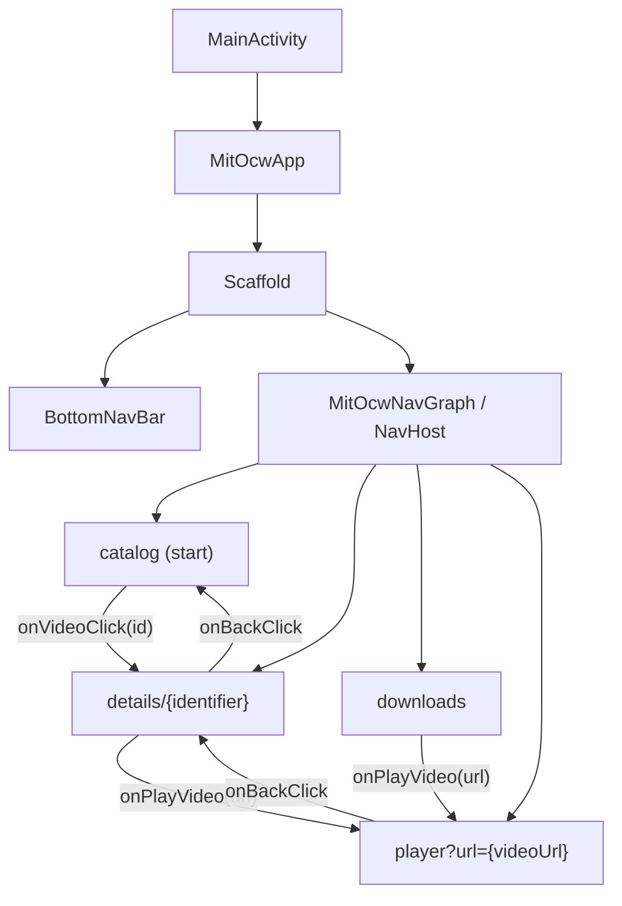

# Navigation

## Navigation Architecture

Single-Activity, multi-Composable navigation with `NavHost`.



## Route Definitions

```kotlin
object NavRoutes {
    const val CATALOG = "catalog"
    const val DETAILS = "details/{identifier}"
    const val DOWNLOADS = "downloads"
    const val PLAYER = "player?url={videoUrl}"

    fun detailsRoute(identifier: String): String = "details/$identifier"
    fun playerRoute(videoUrl: String): String =
        "player?url=${URLEncoder.encode(videoUrl, "UTF-8")}"
}
```

| Route | Pattern | Arguments | Description |
|-------|---------|-----------|-------------|
| Catalog | `catalog` | None | Start destination. Video grid. |
| Details | `details/{identifier}` | `identifier: String` (path) | Video detail screen. |
| Downloads | `downloads` | None | Downloaded videos. |
| Player | `player?url={videoUrl}` | `videoUrl: String` (query, optional) | Video player. URL-encoded. |

## NavHost Configuration

```kotlin
NavHost(
    navController = navController,
    startDestination = NavRoutes.CATALOG,
    modifier = modifier
) {
    composable(NavRoutes.CATALOG) { /* CatalogScreen */ }
    composable(
        route = NavRoutes.DETAILS,
        arguments = listOf(navArgument("identifier") { type = NavType.StringType })
    ) { /* DetailScreen */ }
    composable(NavRoutes.DOWNLOADS) { /* DownloadsScreen */ }
    composable(
        route = NavRoutes.PLAYER,
        arguments = listOf(navArgument("videoUrl") {
            type = NavType.StringType
            defaultValue = ""
        })
    ) { /* VideoPlayerScreen */ }
}
```

## URL Parameter Encoding

Player route uses URL-encoded video URL to handle special characters:

```kotlin
// Encoding (navigation call)
NavRoutes.playerRoute(videoUrl)
// → "player?url=https%3A%2F%2Farchive.org%2Fdownload%2F..."

// Decoding (destination)
val encodedUrl = backStackEntry.arguments?.getString("videoUrl").orEmpty()
val videoUrl = URLDecoder.decode(encodedUrl, "UTF-8")
```

## Bottom Navigation Bar

### Configuration

| Tab | Route | Selected Icon | Unselected Icon |
|-----|-------|--------------|-----------------|
| Catalog | `catalog` | `Icons.Filled.VideoLibrary` | `Icons.Outlined.VideoLibrary` |
| Downloads | `downloads` | `Icons.Filled.Download` | `Icons.Outlined.Download` |

### Visibility

Bottom bar only visible on top-level tabs:

```kotlin
fun shouldShowBottomBar(currentRoute: String?): Boolean {
    return when (currentRoute) {
        NavRoutes.CATALOG,
        NavRoutes.DOWNLOADS -> true
        else -> false  // Hidden on details, player
    }
}
```

### Navigation Behavior

```kotlin
navController.navigate(item.route) {
    popUpTo(navController.graph.findStartDestination().id) {
        saveState = true        // Save tab state when switching
    }
    launchSingleTop = true      // Prevent duplicate destinations
    restoreState = true         // Restore tab state when returning
}
```

This gives standard Android tab behavior:
- Tab state preserved when switching tabs
- Back press from non-start tab goes to start destination
- No duplicate tab entries in back stack

### BottomNavItem Sealed Class

```kotlin
sealed class BottomNavItem(
    val route: String,
    val title: String,
    val selectedIcon: ImageVector,
    val unselectedIcon: ImageVector
) {
    data object Catalog : BottomNavItem(...)
    data object Downloads : BottomNavItem(...)

    companion object {
        val items = listOf(Catalog, Downloads)
    }
}
```

## Screen-to-ViewModel Parameter Passing

### Catalog (no parameters)

```kotlin
viewModel: CatalogViewModel = koinViewModel()
```

### Details (identifier parameter)

```kotlin
// Koin parametersOf for assisted injection
viewModel: DetailViewModel = koinViewModel(parameters = { parametersOf(identifier) })
```

ViewModel constructor:
```kotlin
class DetailViewModel(
    private val identifier: String,    // Injected via parametersOf
    private val videoRepository: VideoRepository,
    private val downloadedVideoDao: DownloadedVideoDao
) : ViewModel()
```

### Player (no ViewModel, injected manager)

```kotlin
val playerManager: VideoPlayerManager = koinInject()
```

## Navigation Events from ViewModel

Detail screen navigates to player via one-shot StateFlow:

```kotlin
// ViewModel
private val _navigateToPlayer = MutableStateFlow<String?>(null)
val navigateToPlayer: StateFlow<String?> = _navigateToPlayer.asStateFlow()

// Screen
LaunchedEffect(navigateToPlayer) {
    navigateToPlayer?.let { videoUrl ->
        onPlayVideo(videoUrl)              // Execute navigation
        viewModel.onPlayerNavigated()      // Reset to prevent re-navigation
    }
}
```

This avoids passing `NavController` to ViewModel (separation of concerns).

## Screen Composable Contracts

Each screen receives navigation callbacks as parameters:

| Screen | Navigation Params |
|--------|------------------|
| `CatalogScreen` | `onVideoClick: (identifier: String) -> Unit` |
| `DetailScreen` | `onBackClick: () -> Unit`, `onPlayVideo: (videoUrl: String) -> Unit` |
| `DownloadsScreen` | `onPlayVideo: (videoUrl: String) -> Unit` |
| `VideoPlayerScreen` | `onBackClick: () -> Unit` |

NavGraph wires these to `navController.navigate()` and `navController.popBackStack()`.
